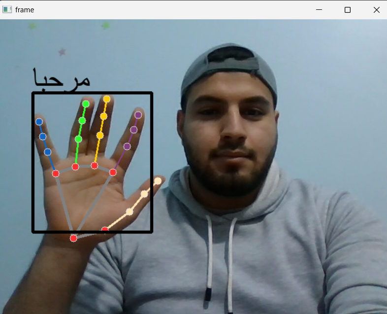
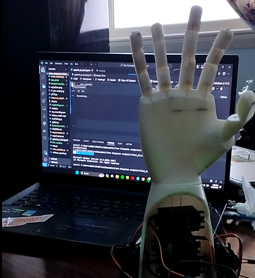

# Arabic Sign Language Communication Project

This project aims to facilitate communication between a normal person and a deaf person using Arabic Sign Language. It consists of two main parts: 

1. **Gesture Recognition and Speech Synthesis:**
   - Utilizes a machine learning model trained with Random Forest to recognize Arabic Sign Language gestures from a live webcam.
   - Displays the recognized gestures as text on a window screen.
   - Converts the text into speech, making it accessible for normal individuals to understand the communication.

2. **Speech-to-Text and Robotic Arm Interaction:**
   - Converts spoken words into text using speech-to-text technology.
   - Sends the text to an Arduino board to translate it into motion.
   - Controls an InMoov robotic arm equipped with servo motors to display the translated text through physical movements.

## Features

- Real-time Arabic Sign Language gesture recognition.
- Textual representation of recognized gestures on a graphical user interface.
- Speech synthesis for improved understanding by non-sign language users.
- Speech-to-text conversion for spoken words.
- Robotic arm motion display of translated text for deaf individuals.

## Prerequisites

Before running the project, ensure you have the following dependencies installed:

- Python (>=3.6)
- OpenCV
- Mediapipe
- Gtts (Google Text-to-Speech)
- Pygame
- Scikit-learn
- Arabic-reshaper
- Bidi
- PIL (Python Imaging Library)
- Sounddevice
- Torchaudio
